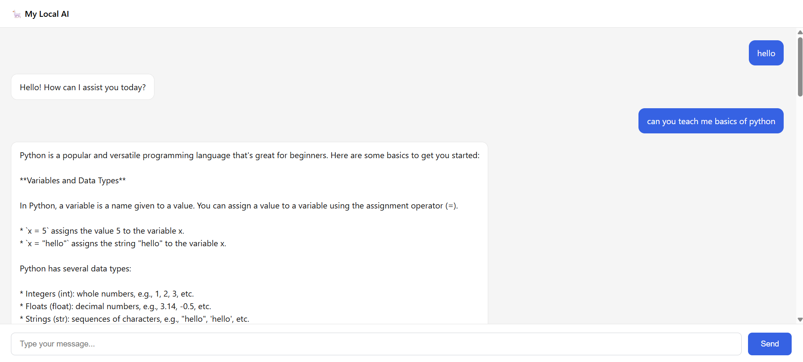

# My Local AI Chatbot

A fully local AI chatbot that runs on your laptop — no API keys, no
subscriptions, no internet required after the model is downloaded.



## What It Does

- Chat with an AI assistant in a clean web interface
- Full conversation memory (remembers earlier messages in the same session)
- Streaming responses — the AI replies word-by-word, like modern chat apps
- Runs 100% locally using [Ollama](https://ollama.com) and the Llama 3.2 model
- **New Chat button** to reset the conversation and start fresh
- **Personality selector** — choose between Assistant, Tutor, Interviewer, and Code Reviewer
- **Live message counter** showing how many messages are in the current session
## Why I Built It

I'm a 3rd-year software engineering student planning to pursue a Master's
in AI. This project was my hands-on introduction to how large language
models actually work under the hood:

- How conversation history is passed to a model on every turn
- How streaming responses are chunked and rendered in real time
- How a FastAPI backend can bridge a browser UI to a local LLM
- Why context windows matter and how they shape real chat applications

## Tech Stack

| Layer | Technology |
|-------|------------|
| Model | Llama 3.2 (3B) via Ollama |
| Backend | Python, FastAPI, Uvicorn |
| Frontend | HTML, CSS, vanilla JavaScript |
| Streaming | Server-sent chunks over `text/plain` |

## How to Run It

### 1. Install Ollama

Download from [https://ollama.com/download](https://ollama.com/download)
and pull the model:

```
ollama pull llama3.2:3b
```

### 2. Clone this repository

```
git clone https://github.com/ayeshasiddikamim/my-chatbot.git
cd my-chatbot
```

### 3. Set up a virtual environment

```
python -m venv .venv
.venv\Scripts\activate    # Windows
source .venv/bin/activate # macOS / Linux
```

### 4. Install dependencies

```
pip install fastapi uvicorn
```

### 5. Run the server

```
uvicorn server:app --reload
```

Then open **http://127.0.0.1:8000** in your browser.

## What I'd Add Next

- User-selectable AI personalities (tutor, interviewer, code reviewer)
- Persistent chat history saved to a database
- Authentication and rate limiting for public access
- Deployment to a cloud server

## License

MIT
